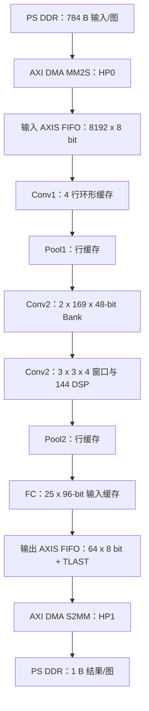

# CNN 加速器存储架构基线与优化审计（Baseline V1）

**项目：** 基于 Zynq-7020 的端侧 CNN 加速器  
**器件：** XC7Z020-2CLG400  
**工具链：** Vivado / Vitis 2020.2  
**PL 时钟：** 100 MHz  
**基线日期：** 2026-09-03  
**阶段状态：** Zynq SoC 集成与板上回归已通过；进入存储架构与系统效率优化阶段

---

## 1. 基线结论

当前版本已经形成可信的功能与性能基线：

- RTL、综合网表和板上执行均与 bit-exact 定点模型一致；
- 10 张详细板上回归为 10/10；
- 1000 张板上回归为硬件/模型 1000/1000 一致；
- 当前循环标签回归集为 990/1000，即 99.00%；
- SoC 在 100 MHz 下实现后 Setup WNS = +0.153 ns、Hold WHS = +0.028 ns；
- CNN 核使用 9,083 LUT、3,732 LUTRAM、3,256 FF、152 DSP、0 BRAM36；
- 最新统一程序板上运行的 Active 平均延迟为 20.336 us，Application 平均延迟为 24.845 us。

当前最重要的存储结论是：

> CNN 核中显式的主要模型数据和缓存合计仅约 4.91 KiB，但 Conv2 完整特征图双 Bank 需要同周期提供 9 个独立读地址，Vivado 为实现多读端口而复制分布式存储，最终仅 `conv2_buf` 就占用 3,456 个 LUTRAM。问题的核心不是容量，而是端口数、数据布局和并行读取方式。

---

## 2. 系统数据流与存储层次



系统采用单一 100 MHz PL 时钟域。输入、输出 DMA 流宽均为 8 bit。输入图像和最终结果位于 PS DDR；CNN 权重、偏置和中间激活均位于 PL 片上逻辑中。

当前权重通过 `$readmemh` 在综合时固化进 bitstream，不支持运行时替换。因此当前系统属于“固定网络参数的专用加速器”，还不是可由软件加载权重的通用 CNN IP。

---

## 3. 网络形状与跨层数据量

| 阶段 | 张量形状 | 每拍接口宽度 | 每帧有效拍数 | 完整张量数据量 | 是否完整保存 |
|---|---:|---:|---:|---:|---|
| 输入图像 | 28 x 28 x 1，UINT8 | 8 bit | 784 | 784 B | PS DDR 与输入 FIFO；核内不保存整图 |
| Conv1 输出 | 26 x 26 x 4，INT12 | 48 bit | 676 | 4,056 B | 否，直接流向 Pool1 |
| Pool1 输出 | 13 x 13 x 4，非负 INT12 | 48 bit | 169 | 1,014 B | 是，Conv2 每个 Bank 保存一份 |
| Conv2 输出 | 11 x 11 x 8，INT12 | 96 bit | 121 | 1,452 B | 否，直接流向 Pool2 |
| Pool2 输出 | 5 x 5 x 8，非负 INT12 | 96 bit | 25 | 300 B | 是，完整保存到 FC 输入缓存 |
| FC 输出 | 10 个 INT12 logit | 内部数组 | 10 | 15 B | 是，argmax 前短暂保存 |
| 分类结果 | 0～9 | 8 bit | 1 | 1 B | 输出寄存器、FIFO及 PS DDR |

“完整张量数据量”表示若把该层全部输出同时保存所需的逻辑容量，不代表当前 RTL 一定分配了同样大小的存储。

---

## 4. CNN 核逐层存储审计

### 4.1 主要模型数据与缓存

| 层级 | 数据对象与 RTL 位置 | 逻辑组织 | 有效容量 | 访问形态与生命周期 | 实现后物理观察 |
|---|---|---:|---:|---|---|
| Conv1 | `conv1_buf.v: buffer` | 112 x 8 bit | 896 bit = 112 B | 4 行循环缓存；每个输入有效拍写 1 点，并形成 3 x 3 窗口的 9 点读取 | `u_conv1_buf`：204 LUTRAM；未使用 BRAM |
| Conv1 | `conv1_calc.v: weight/bias` | 36 x 8 + 4 x 8 bit | 320 bit = 40 B | 固定参数；4 个输出通道并行，需要同拍使用 36 个权重 | `u_conv1_calc` 的 LUTRAM 为 0；参数被吸收到常量逻辑/乘加网络中 |
| Pool1 | `maxpool_relu.v: line_buf/temp_max` | 13 x 48 + 48 bit | 672 bit = 84 B | 保存偶数行的横向最大值和当前像素对的临时最大值；跨两个输入行存在 | `u_pool1`：0 LUTRAM、670 FF，主要映射为寄存器 |
| Conv2 | `conv2_buf.v: bank_A/bank_B` | 2 x 169 x 48 bit | 16,224 bit = 2,028 B | 整帧 Ping-Pong；写满 169 拍后，按窗口位置同拍读取 9 个 48-bit 像素 | `u_buf`：3,456 LUTRAM、973 Logic LUT、71 FF、0 BRAM |
| Conv2 | `conv2_calc.v: p_latched` | 4 x 9 x 13 bit | 468 bit = 58.5 B | 锁存一个 3 x 3 x 4 窗口，供两组输出通道计算复用 | 寄存器/DSP 输入级；没有独立 BRAM |
| Conv2 | `conv2_calc.v: weight/bias` | 288 x 8 + 8 x 16 bit | 2,432 bit = 304 B | 固定参数；每组 4 个输出通道同拍读取 4 x 4 x 9 = 144 个权重 | `u_calc` 的 LUTRAM为 0；权重读选择被吸收到逻辑与 DSP 输入网络中 |
| Pool2 | `maxpool_relu.v: line_buf/temp_max` | 5 x 96 + 96 bit | 576 bit = 72 B | 与 Pool1 相同的流式 2 x 2 池化生命周期 | `u_pool2`：0 LUTRAM、633 FF，主要映射为寄存器 |
| FC | `fully_connected.v: pool_buf` | 25 x 96 bit | 2,400 bit = 300 B | 完整保存 Pool2 输出；随后被 10 个神经元重复读取 | `u_fc` 总计 72 LUTRAM，主要来源为该输入缓存 |
| FC | `fully_connected.v: weight_rom/bias_rom` | 10 x 1600 + 10 x 8 bit | 16,080 bit = 2,010 B | 固定参数；每拍读取当前神经元的 8 个权重 | 没有独立 BRAM；宽 ROM 主要被实现为常量选择逻辑 |
| FC | `fully_connected.v: logits` | 10 x 12 bit | 120 bit = 15 B | 保存 10 类得分，直到 argmax 完成 | 小型寄存器/分布式逻辑 |

容量汇总：

```text
固定权重与偏置：40 + 304 + 2010 = 2354 B
主要激活与缓存：112 + 84 + 2028 + 58.5 + 72 + 300 + 15 = 2669.5 B
合计：5023.5 B ≈ 4.91 KiB
```

该 4.91 KiB 是主要模型数据与架构缓存的“有效逻辑容量”，不包括控制寄存器、流水线中间寄存器、DSP48 内部寄存器以及综合时因多读端口产生的存储副本，因此不能直接换算为 FPGA 物理存储资源。

### 4.2 计算流水寄存状态

除上表外，流水化计算还保存中间乘积与加法树状态：

- Conv1 使用 4 通道并行的乘法、分级加法和 valid 流水；
- Conv2 使用 `product_s1`、`stg1_mult_sum`、`stg2_total_sum` 及 valid/group 流水；
- FC 使用 `data_s0`、`weights_s0`、8 路乘积和 4/2/1 平衡加法树。

这些状态的物理实现可能位于 Slice FF、DSP48 内部寄存器或被综合优化，不应与特征图/权重容量简单相加。实现后层次报告给出的 Slice FF 结果是：Conv1 1,106、Pool1 670、Conv2 667、Pool2 633、FC 155。

---

## 5. 系统级存储映射

| 系统对象 | 配置容量 | 物理映射 | 作用 |
|---|---:|---|---|
| PS DDR 输入缓冲 | 至少 784 B/图 | Zynq PS DDR | Vitis 准备输入；MM2S 通过 HP0 读取 |
| AXI DMA 内部缓冲 | IP 内部配置决定 | 2 个 RAMB36 | MM2S 与 S2MM DataMover 缓冲各使用 1 个 RAMB36 |
| 输入 AXIS FIFO | 8192 x 8 bit = 8,192 B | 2 个 RAMB36 | 解耦 DMA MM2S 与 CNN 输入握手；配置为无 TLAST |
| CNN 核主要逻辑存储 | 约 4.91 KiB 有效数据 | 3,732 LUTRAM、Slice FF、常量逻辑；0 BRAM | 权重、偏置、窗口、特征图 Bank、FC 输入与 logit |
| 输出 AXIS FIFO | 64 x 8 bit = 64 B | 14 LUTRAM | 保存分类结果及 TLAST，解耦 CNN 与 S2MM |
| PS DDR 输出缓冲 | 1 B/图 | Zynq PS DDR | S2MM 通过 HP1 写回；CPU Cache Invalidate 后读取 |

SoC 一共使用 4 个 RAMB36：AXI DMA 2 个、输入 AXIS FIFO 2 个。CNN 核自身没有使用 BRAM。

---

## 6. 实现后资源集中度

| 层级 | LUT | Logic LUT | LUTRAM | FF | DSP |
|---|---:|---:|---:|---:|---:|
| CNN 核总计 | 9,083 | 5,351 | 3,732 | 3,256 | 152 |
| Conv1 | 1,699 | 1,495 | 204 | 1,106 | 0 |
| Pool1 | 247 | 247 | 0 | 670 | 0 |
| Conv2 | 6,081 | 2,625 | 3,456 | 667 | 144 |
| └ Conv2 Buffer | 4,429 | 973 | 3,456 | 71 | 0 |
| └ Conv2 Calc | 1,654 | 1,654 | 0 | 596 | 144 |
| Pool2 | 346 | 346 | 0 | 633 | 0 |
| FC | 684 | 612 | 72 | 155 | 8 |

由此得到：

- Conv2 占 CNN 核 LUT 的约 67.0%；
- Conv2 使用 144/152 DSP，占 CNN DSP 的约 94.7%；
- Conv2 Buffer 使用 3,456/3,732 LUTRAM，占 CNN LUTRAM 的约 92.6%；
- Conv2 Buffer 单独占整个 SoC 3,970 个 LUTRAM 的约 87.1%；
- CNN 核占整个 SoC LUTRAM 的约 94.0%。

因此，首要硬件优化对象应明确锁定为 `conv2_buf`，而不是参数量更大的 FC 权重。

---

## 7. 为什么 2,028 B 的 Conv2 Bank 会消耗 3,456 个 LUTRAM

`bank_A` 和 `bank_B` 的逻辑容量只有 2,028 B，但每次 `S_EMIT` 都用 9 个不同地址同时读取一个 3 x 3 窗口：

```text
9 个地址 x 48 bit = 432 bit/cycle 的激活读取宽度
```

普通 BRAM36 原生只有有限的读写端口，无法直接提供 9 个独立随机读地址。为了保持当前“一拍吐出完整窗口”的 RTL 语义，综合器只能采用以下一种或多种手段：

1. 把数组映射为 Distributed RAM；
2. 为额外读端口复制存储内容；
3. 使用大量地址译码和输出多路选择逻辑；
4. 对两个完整 Bank 分别复制上述结构。

所以，LUTRAM 数量衡量的是“实现这些存储端口所占的 LUT 数”，不是数据字节数。逻辑容量小并不意味着物理代价小。

Conv2 权重读取也存在类似问题：4 个并行输出通道 x 4 个输入通道 x 9 个卷积核元素，共 144 个 INT8 权重同拍参与乘法，即 1,152 bit/cycle 的参数读取需求。当前权重被固化并吸收到逻辑/DSP 输入网络；若未来改成运行时可加载权重，就必须引入分块预取或降低并行读取端口数，不能直接用普通双端口 SRAM 替换。

---

## 8. 当前数据生命周期与并发限制

| 数据 | 产生时刻 | 保留到 | 复用次数/方式 |
|---|---|---|---|
| 输入像素 | DMA 与 CNN 握手 | Conv1 环形行被覆盖 | 通过 4 行循环缓存参与最多 3 x 3 邻域 |
| Conv1 输出 | Conv1 valid | Pool1 当拍消费 | 不保存完整特征图 |
| Pool1 输出 | Pool1 valid | 对应 Conv2 Bank 的 121 个窗口全部读取完成 | 一个像素参与多个重叠 3 x 3 窗口 |
| Conv2 窗口 | `conv2_buf` 发出 | 两组输出通道计算完成 | 同一个 3 x 3 x 4 窗口复用于 OC0～3、OC4～7 两组 |
| Conv2 输出 | 第二组通道装配完成 | Pool2 当拍消费 | 不保存完整特征图 |
| Pool2 输出 | Pool2 valid | 10 个 FC 神经元全部计算完成 | 每个激活被 10 个神经元复用 |
| FC logits | 每个神经元完成 | argmax 完成 | 比较后只保留类别编号 |

顶层 `axis_cnn_mnist` 的 `frame_busy` 策略只允许一帧在途：第 784 个输入握手后停止接收新帧，直到当前结果完成输出握手才释放输入端。因此，在当前系统中，Conv2 的第二个完整 Bank 并没有用于“处理当前帧的同时接收下一帧”。它保留了未来多帧重叠的结构可能性，却在 Baseline V1 中支付了双份存储及端口复制成本。

这是本轮审计得到的关键架构事实。

---

## 9. 最新板上性能基线与测量边界

### 9.1 最新统一程序结果

| 指标 | 10 图详细测试 | 1000 图批量测试 |
|---|---:|---:|
| 完成数量 | 10/10 | 1000/1000 |
| 硬件/模型一致 | 10/10 | 1000/1000 |
| 标签正确 | — | 990/1000，99.00% |
| Active latency | min 20.306、avg 20.351、max 20.492 us | min 20.297、avg 20.336、max 20.615 us |
| Application avg latency | 25.148 us | 24.845 us |
| Active throughput | 49,132 images/s | 49,167 images/s |
| Application throughput | 39,763 images/s | 40,246 images/s |
| 批量 wall time | — | 24.846 ms |

1000 图测试中的 10 个标签错误全部是已知模型行为：编号 22、122、222、322、422、522、622、722、822、922 的标签为 2，模型和硬件都判为 7。

### 9.2 三个时间边界

| 测量层级 | 定义 | 当前结果 |
|---|---|---:|
| CNN 核理论结果间隔 | 1,664 cycles / 100 MHz | 16.640 us，约 60,096 images/s |
| Active | 启动 S2MM 前至 MM2S/S2MM 均完成；包含 DMA 配置、传输、CNN 与轮询，不含前置 Flush 和后置 Invalidate | 20.336 us，49,167 images/s |
| Application | 无逐图 UART 的完整循环；还包含 memcpy、Cache 维护和结果统计 | 24.845 us，40,246 images/s |

由最新结果计算：

```text
DMA/传输/轮询 Active 附加开销：20.336 - 16.640 = 3.696 us/image
Cache/复制/软件统计附加开销：24.845 - 20.336 = 4.509 us/image
核心到应用总附加开销：24.845 - 16.640 = 8.205 us/image
Active 吞吐达到理论核心上限的约 81.8%
Application 吞吐达到理论核心上限的约 67.0%
```

当前每张图分别启动一次 MM2S 和一次 S2MM，CPU 准备、DMA 传输和 CNN 计算没有跨帧重叠。因而这里测得的是“单帧事务重复执行的应用吞吐”，不是连续帧流水化后的最大吞吐。

功能结论已经成立。若要把这组性能数字写入正式论文，还应同时记录 Vitis 的实际构建配置；只有确认编译命令为 Release、`-O2` 后，才能作为正式软件性能基线。

---

## 10. 第一轮 Conv2 存储 A/B 实验

为避免一次重构过大，按两个子实验推进。

### 10.1 实验 B0：单完整 Bank 诊断版

目的：验证 Conv2 LUTRAM 的主要成本是否近似来自两个完整 Bank 的复制，同时保持窗口读取、计算流水和层间时序基本不变。

修改范围仅限 `conv2_buf`：

- 保留一个 `169 x 48-bit` 完整特征图 Bank；
- 仍然写满 169 拍后开始输出 121 个 3 x 3 窗口；
- 保持 9 点同拍读取和现有 `calc_busy` 握手；
- 删除 Bank A/B 切换及第二份存储；
- 利用顶层“一帧在途”约束保证读写阶段不重叠。

预期：

- 有效 Bank 容量从 2,028 B 降到 1,014 B；
- Conv2 Buffer LUTRAM 有机会从 3,456 下降到约一半，但最终值必须以综合报告为准；
- 核心周期和首帧延迟基本不改善；
- 这是低风险资源诊断，不是最终流式架构。

### 10.2 实验 B1：流式行缓存 + 3 x 3 窗口

目的：不再等待完整 `13 x 13 x 4` 特征图写满，而是随着 Pool1 输出流实时构造 Conv2 窗口。

建议组织：

```text
2 x 13 x 48-bit 行缓存 + 3 x 3 x 48-bit 窗口寄存器
= 1248 bit + 432 bit
= 1680 bit = 210 B（未计小型解耦 FIFO）
```

与当前双 Bank 的 2,028 B 相比，主要窗口存储的逻辑容量可下降约 89.6%。更重要的是，读取端口从“9 个随机地址”改为“顺序行缓存读取 + 窗口移位”，从源头消除多读端口复制。

B1 还可在收到前 2 行和第 3 行前 3 个像素后启动第一个 Conv2 窗口，避免等待全部 169 个 Pool1 输出完成。

### 10.3 预注册验收条件

| 指标 | Baseline V1 | B0/B1 验收要求 |
|---|---:|---|
| Conv2 逐元素 bit-exact | 121 x 8 全一致 | 必须保持全一致 |
| 10 图回归 | 10/10 | 必须 10/10 |
| 1000 图硬件/模型 | 1000/1000 | 必须 1000/1000 |
| 随机反压 | 通过 | 不丢失、不重复、不乱序 |
| Setup WNS @100 MHz | +0.153 ns | 必须 >= 0 |
| Hold WHS | +0.028 ns | 必须 >= 0 |
| Conv2 Buffer LUTRAM | 3,456 | B0 目标接近减半；B1 至少下降 50% |
| CNN 核 LUTRAM | 3,732 | B1 目标 <= 1,866 |
| DSP | 152 | 保持 152，除非另行开展并行度实验 |
| 核心结果间隔 | 1,664 cycles | 不高于 1,664 cycles；若变化需逐项解释 |
| Active avg latency | 20.336 us | 不劣化，并记录变化来源 |
| Application avg latency | 24.845 us | 不劣化，并记录变化来源 |

每个实验必须使用同一组权重、同一 bit-exact 模型、同一 10/1000 图数据和同一 100 MHz 约束。不得同时修改 Conv2 存储、计算并行度、量化规则或 DMA 软件，否则无法判断收益来源。

---

## 11. 后续执行顺序

1. 冻结 Baseline V1 的 RTL、16 个参数文件、Block Design、bitstream、XSA、Vitis 统一程序及完整串口日志；
2. 为当前构建记录文件哈希和唯一 `BUILD_ID`；
3. 确认正式性能构建是否为 Release、`-O2`；
4. 实现 B0 单 Bank 版本并完成层级仿真、综合资源对比；
5. 若 B0 验证了近似双份存储成本，再实现 B1 流式行缓存；
6. 对 B1 依次执行 Conv2 层级测试、端到端测试、随机反压、综合、实现和板上 10/1000 图回归；
7. 存储架构稳定后，再单独开展批量 DMA、双缓冲或中断模式的系统吞吐优化。

---

## 12. 已发现的审计项

### 12.1 Conv2 偏置文件宽度必须随冻结版本确认

当前可见 RTL 将 Conv2 偏置声明为 `reg signed [15:0] bias [0:7]`，而可见的 `conv2_bias.mem` 使用 8-bit 十六进制 token（如 `ec`、`f5`、`ee`）。bit-exact 模型按 signed INT8 解释这些值。

由于已部署硬件与 bit-exact 决策达到 1000/1000，一致性基线本身可信；但在冻结可复现构建时，仍必须确认 Vivado 工程实际使用的参数文件内容及其高 8 位表示，避免以后重建工程时出现 `0x00ec` 与 `0xffec` 的符号解释差异。

### 12.2 源码注释不能代替物理映射报告

`conv2_buf.v` 的注释称 Bank 为“BRAM Bank”，但实现结果明确显示它使用 3,456 LUTRAM、0 BRAM。今后的架构文档必须始终区分：

- RTL 逻辑数组；
- 综合推断的存储类型；
- 实现后的实际物理资源。

---

## 13. 证据索引

| 证据文件 | 本文用途 |
|---|---|
| `upload/axix_cnn_mnist.v` | 顶层一帧在途控制与层间接口 |
| `upload/conv1_buf.v`、`upload/conv1_calc.v` | Conv1 行缓存、参数和读端口 |
| `upload/maxpool_relu.v` | Pool1/Pool2 行缓存容量 |
| `upload/conv2_buf.v` | 双 Bank 容量、9 地址同拍读取与生命周期 |
| `cnn_acc_3_first_batch/rtl/conv2_calc.v` | 最终 Conv2 流水、144 路权重读取与窗口锁存 |
| `cnn_acc_3_first_batch/rtl/fully_connected.v` | 最终 FC 输入缓存、权重 ROM 和流水 |
| `upload/design_1.tcl` | DMA、HP0/HP1、FIFO 深度、流宽和连接 |
| `upload/soc_impl_utilization_hier.rpt` | CNN 各层、DMA和FIFO的实现后资源 |
| `upload/soc_impl_utilization.rpt` | SoC 总资源及物理 RAM 原语 |
| `upload/soc_impl_timing_summary.rpt` | 100 MHz Setup/Hold 时序基线 |
| `upload/503c167b-c59d-49b5-b457-508ab3ab52e4.png` | 最新统一 10/1000 图板上测试结果 |

---

**阶段结论：** Baseline V1 的存储层次已经能够解释到“数据放在哪里、保存多久、怎样读取、综合成什么资源以及为什么昂贵”。第一个隔离优化应从 `conv2_buf` 的 B0 单 Bank 诊断版开始，随后进入 B1 流式行缓存方案。
