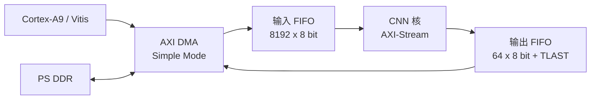

# CNN 加速器 Zynq-7020 端侧部署阶段报告

**项目阶段：** CNN 计算核心优化、Zynq SoC 集成与板上回归
**开发板：** 正点原子领航者 ZYNQ-7020 V1
**器件：** XC7Z020-2CLG400
**工具链：** Vivado / Vitis 2020.2
**报告日期：** 2026-09-03
**阶段状态：** 已完成

## 1. 阶段结论

本阶段已经完成从定点 CNN 模型、可综合 RTL、100 MHz 时序收敛，到 Zynq PS + AXI DMA + PL CNN 加速器集成及真实板卡运行的完整闭环。最终系统能够由 Cortex-A9 裸机程序从 DDR 读取图像，通过 AXI DMA 向 CNN 加速器发送 784 字节输入，并将 1 字节分类结果写回 DDR。

当前最重要的验收结果如下：

- RTL、综合网表及板上输出均与 bit-exact 定点模型一致；
- 10 张详细板上回归为 10/10；
- 1000 张板上回归为硬件/模型 1000/1000 一致；
- 当前回归集标签正确率为 990/1000，即 99.00%；
- 最终 SoC 在 100 MHz 下实现后 WNS = +0.153 ns、WHS = +0.028 ns；
- 所有 19,356 个可布线网络均已完成布线，路由错误为 0；
- 已生成 Bitstream 和包含 Bitstream 的 XSA，并完成 Vitis Hello World 与 AXI DMA 实测。

因此，本项目已经从“仿真可用的 CNN RTL”推进到“可在真实 Zynq 板卡上运行并可量化评估的端侧加速系统”。

## 2. 最终系统架构



系统采用单一 100 MHz PL 时钟域。关键配置如下：

| 项目           | 最终配置                                   |
| -------------- | ------------------------------------------ |
| Zynq PS        | Processing System 7                        |
| PL 时钟        | FCLK_CLK0，100 MHz                         |
| 软件运行环境   | Cortex-A9，Standalone 裸机                 |
| PS 调试输出    | UART0，115200 bit/s                        |
| DMA 模式       | AXI DMA Simple Mode，不使用 Scatter-Gather |
| DMA 流宽       | MM2S 8 bit，S2MM 8 bit                     |
| 输入数据       | 每张 28 × 28 = 784 字节                   |
| 输出数据       | 每张 1 字节，取值 0～9                     |
| MM2S DDR 端口  | PS S_AXI_HP0                               |
| S2MM DDR 端口  | PS S_AXI_HP1                               |
| DMA 控制地址   | `0x40400000`                             |
| AXI INTC 地址  | `0x41800000`                             |
| 输入 AXIS FIFO | 深度 8192，无 TLAST                        |
| 输出 AXIS FIFO | 深度 64，带 TLAST                          |

CNN 输入端不依赖 TLAST，而是在内部统计 784 次有效握手；CNN 输出端产生 1 字节分类结果和 TLAST。输入、输出通道均遵循 AXI-Stream 的 `TVALID/TREADY` 协议，输出数据在反压期间保持稳定。

## 3. RTL 与时序优化过程

### 3.1 权重综合问题修复

早期综合中，Vivado 未能读取 16 个权重及偏置 `.mem` 文件，导致参数通路被裁剪。当时只有 2490 LUT、1343 FF 和 8 DSP，该结果不代表真实 CNN，不能作为正式资源或时序基线。

将全部 `.mem` 文件加入 Design Sources 并启用综合后，资源恢复为 9715 LUT、3732 LUTRAM、3194 FF 和 152 DSP，证实网络参数已经进入综合网表。随后，10 张综合网表功能仿真与 bit-exact 模型完全一致，排除了行为仿真和综合电路不等价的风险。

### 3.2 FC 流水化

有效权重版本的综合时序为 WNS = -8.578 ns，关键路径位于全连接层的 8 路 DSP 级联乘加。FC 被改为：

```text
权重锁存 → 8 路乘法寄存 → 4/2/1 平衡加法树 → 累加器
```

修改保持接口、权重顺序、位宽、截断、饱和和分类结果不变。修改后综合 WNS 提升到 +0.074 ns，但实现后 WNS 为 -0.463 ns，关键路径转移到 Conv2。

### 3.3 Conv2 流水化

Conv2 原关键路径为乘法与 9 项累加的长组合路径。修改后在乘法结果后增加寄存级，并使用平衡加法树。最终纯 CNN 核实现后 WNS 提升到 +0.350 ns；集成完整 SoC 后 WNS 为 +0.153 ns。

优化过程汇总如下：

| 版本               | 时序阶段        |       WNS | 功能结果间隔 | 结论                 |
| ------------------ | --------------- | --------: | -----------: | -------------------- |
| 权重正确、未流水化 | 综合            | -8.578 ns |  1613 cycles | FC 关键路径，失败    |
| FC 流水化          | 综合            | +0.074 ns |  1663 cycles | 综合刚好通过         |
| FC 流水化          | 实现后          | -0.463 ns |  1663 cycles | Conv2 关键路径，失败 |
| FC + Conv2 流水化  | 纯 CNN 核实现后 | +0.350 ns |  1664 cycles | 通过                 |
| 最终 Zynq SoC      | 实现后          | +0.153 ns |  1664 cycles | 100 MHz 通过         |

流水化总共将每帧结果间隔从 1613 cycles 增加到 1664 cycles，即增加 51 cycles；代价可控，并换取了真实布局布线后的 100 MHz 时序收敛。

## 4. 最终实现结果

### 4.1 时序与布线

| 检查项         |        结果 |
| -------------- | ----------: |
| 时钟周期       |   10.000 ns |
| 工作频率       | 100.000 MHz |
| Setup WNS      |   +0.153 ns |
| Setup TNS      |        0 ns |
| Setup 失败端点 |  0 / 53,347 |
| Hold WHS       |   +0.028 ns |
| Hold THS       |        0 ns |
| Hold 失败端点  |  0 / 53,347 |
| 未约束内部端点 |           0 |
| 可布线网络     |      19,356 |
| 已完整布线网络 |      19,356 |
| 路由错误       |           0 |

最差路径仍位于 Conv2 的 `calc_state` 到 DSP 乘法输入寄存器，但已经满足约束。按当前结果粗略估算的极限频率约为 101.55 MHz；这只是静态估算，不应据此将正式板上时钟提高到 100 MHz 以上。当前 +0.153 ns 的余量较小，100 MHz 应保留为正式工作频率。

### 4.2 SoC 总资源

| 资源                    | 使用量 | 器件总量 | 利用率 |
| ----------------------- | -----: | -------: | -----: |
| Slice LUT               | 12,013 |   53,200 | 22.58% |
| LUT as Logic            |  7,870 |   53,200 | 14.79% |
| LUT as Memory           |  4,143 |   17,400 | 23.81% |
| Distributed RAM LUT     |  3,970 |       — |     — |
| SRL LUT                 |    173 |       — |     — |
| Slice Register          |  6,785 |  106,400 |  6.38% |
| Block RAM Tile / RAMB36 |      4 |      140 |  2.86% |
| DSP48E1                 |    152 |      220 | 69.09% |

### 4.3 CNN 核资源分布

| 模块       |   LUT | LUTRAM |    FF | BRAM36 | DSP |
| ---------- | ----: | -----: | ----: | -----: | --: |
| CNN 核总计 | 9,083 |  3,732 | 3,256 |      0 | 152 |
| Conv1      | 1,699 |    204 | 1,106 |      0 |   0 |
| Pool1      |   247 |      0 |   670 |      0 |   0 |
| Conv2      | 6,081 |  3,456 |   667 |      0 | 144 |
| Pool2      |   346 |      0 |   633 |      0 |   0 |
| FC         |   684 |     72 |   155 |      0 |   8 |

资源分布表明：

- CNN 核占 SoC 总 LUT 的约 75.6%；
- Conv2 使用 144 个 DSP，占 CNN 全部 DSP 的约 94.7%；
- Conv2 使用 3456 个 LUTRAM，占 CNN LUTRAM 的约 92.6%；
- CNN 内部仍未使用 BRAM；系统的 4 个 BRAM36 分别来自 AXI DMA 的 2 个 BRAM36和输入 AXIS FIFO 的 2 个 BRAM36；
- 输出 FIFO 深度较小，使用 14 个 LUTRAM。

这说明下一阶段最有研究价值的硬件优化对象不是 FC，而是 Conv2 特征图存储及其多端口读取方式。

## 5. 验证闭环

| 层级             | 测试内容                                | 结果              |
| ---------------- | --------------------------------------- | ----------------- |
| 层级行为仿真     | Conv1、Pool1、Conv2、Pool2、FC 定点结果 | 通过              |
| RTL 端到端仿真   | 10 张批量分类                           | 10/10 与模型一致  |
| AXI 协议测试     | 输入握手、输出反压及数据保持            | 通过              |
| 综合网表功能仿真 | 10 张、7840 次输入握手                  | 10/10，与模型一致 |
| 时序优化回归     | FC 与 Conv2 流水化后的数值一致性        | 通过              |
| 最终实现检查     | Setup、Hold、约束、布线                 | 全部通过          |
| PS 板级验证      | Hello World、UART、JTAG、DDR、XSA       | 通过              |
| 单图板上推理     | 图像 0 → 分类 0                        | 通过              |
| 10 图板上回归    | 数字 0～9                               | 10/10 与模型一致  |
| 1000 图板上回归  | 硬件与 bit-exact 模型逐张比较           | 1000/1000 一致    |

这里应明确区分两个指标：

1. **硬件/模型一致率 1000/1000** 证明 RTL、综合、实现、DMA 和板上执行没有改变定点模型的决策；
2. **标签正确率 990/1000** 表示当前定点模型在这批构造回归数据上的分类结果，其中 10 个标签为 2 的样本被模型判为 7。

当前文件使用 `labels_1000_cyclic.mem`，因此 99.00% 是当前循环标签回归集的结果，不能直接写成完整 MNIST 官方 10,000 张测试集准确率。

## 6. 板上性能基线

### 6.1 理论核心周期

最终 RTL 的结果间隔为 1664 cycles，在 100 MHz 下：

$ T_{core}=\frac{1664}{100\times10^6}=16.640\ \mu s$

理想连续发射吞吐率为：

$P_{core}=\frac{100\times10^6}{1664}\approx60,096\ \text{images/s}$

### 6.2 实测结果

| 测试    | Active latency                                 | Application latency / wall time | 吞吐率                                              | 一致性    |
| ------- | ---------------------------------------------- | ------------------------------- | --------------------------------------------------- | --------- |
| 10 张   | min 20.297 μs，avg 20.360 μs，max 20.465 μs | 未作为正式批量指标              | 49,108 images/s                                     | 10/10     |
| 1000 张 | min 20.300 μs，avg 20.342 μs，max 20.621 μs | avg 24.863 μs；总计 24.866 ms  | Active 49,156 images/s；Application 40,214 images/s | 1000/1000 |

程序中的计时范围定义为：

- **Active latency：** 从启动 S2MM 前开始，到 MM2S 与 S2MM 均完成为止，包含 DMA 配置、传输、CNN 推理及轮询等待；不包含计时前的 Cache Flush 和计时后的 Cache Invalidate；
- **Application latency：** 整个无 UART 输出的批量循环平均时间，还包含图像 `memcpy`、Cache 维护和结果统计等软件开销；
- 1000 张测试在正式计时前执行一次 warm-up，warm-up 不计入统计；
- UART 输出全部放在计时循环之外。

与 16.640 μs 的核心周期相比：

| 开销项                                   |        平均时间 |
| ---------------------------------------- | --------------: |
| DMA 启动、传输和轮询等 Active 附加开销   | 3.702 μs/image |
| 图像复制、Cache 维护和软件统计等附加开销 | 4.521 μs/image |
| 从核心周期到应用平均延迟的总附加开销     | 8.223 μs/image |

实测 Active 吞吐率约为理想核心吞吐率的 81.8%，应用吞吐率约为理想核心吞吐率的 66.9%。当前软件每张图单独启动两路 DMA 并轮询完成，没有将多帧传输、CNN 计算和 CPU 准备过程重叠，因此仍有明确的软件与数据流优化空间。

## 7. DRC 与工程风险说明

最终实现后 DRC 没有 Error 或 Critical Warning，共有 357 项非阻塞提示：

| 规则     | 级别     | 数量 | 说明                     |
| -------- | -------- | ---: | ------------------------ |
| DPIP-1   | Warning  |  207 | DSP 输入流水建议         |
| DPOP-1   | Warning  |   64 | DSP PREG 输出流水建议    |
| DPOP-2   | Warning  |   84 | DSP MREG 输出流水建议    |
| REQP-181 | Advisory |    2 | RAM write-first 相关建议 |

这些提示不阻止 Bitstream 生成，当前 100 MHz 时序和板上功能均已通过。由于时序裕量只有 +0.153 ns，若修改 RTL、权重、Block Design 或实现策略，必须重新执行完整的综合、实现、时序和板上回归。

还需注意以下边界：

- 当前板上性能数据来自此前显示为 Debug、`-O0` 的构建流程，因此功能结论有效，但论文中的正式软件性能应在 Release、`-O2` 下复测并记录；
- 现有 1000 张数据用于硬件/模型一致性与当前模型基线验证，不等同于完整 MNIST 官方测试集；
- 100 MHz 以上频率尚未验证，不应根据粗略 Fmax 估算直接提高时钟；
- 当前应用为轮询模式，尚未评估中断模式、双缓冲或连续多帧 DMA 的收益；
- 尚未完成板级功耗、能效和温度测量。

## 8. 已形成的可复用成果

### 硬件

- 完整 Zynq Block Design：PS7、AXI DMA、双 HP 口、双 AXIS FIFO、AXI INTC、CNN 核；
- 100 MHz 时序收敛的 FC 与 Conv2 流水化 RTL；
- 可生成 Bitstream 的 `cnn_system_wrapper`；
- 已导出的含 Bitstream XSA；
- 综合、实现、时序、资源、布线和 DRC 报告。

### 软件与数据

- 单图 AXI DMA 轮询测试；
- 10 图详细回归测试；
- 1000 图准确率与性能测试；
- 统一测试入口：`cnn_run_10_image_test()` 和 `cnn_run_1000_image_test()`；
- 1000 图输入、标签、bit-exact 决策及板上结果统计。

统一版 `main.c` 已将两项测试放在同一应用中，并支持 10 图、1000 图或顺序执行两者三种模式。其两部分逻辑均源于已经分别完成板上验证的程序；统一入口本身仍建议在默认 BOTH 模式下做一次最终冒烟测试并保存串口日志。

## 9. 下一阶段建议

建议按照以下优先级继续：

1. **固化正式性能数据。** 使用 Release、`-O2`，运行统一程序的 BOTH 模式，记录 10 图明细、1000 图汇总、ELF 大小和串口完整日志。
2. **优化 Conv2 存储架构。** 研究顺序 BRAM 读取配合行缓冲/窗口缓存，减少 3456 个 Conv2 LUTRAM，同时保持 100 MHz 和 bit-exact 结果。
3. **优化系统吞吐率。** 使用多帧 DMA、双缓冲或中断，重叠 CPU 数据准备、DDR 传输和 CNN 计算，使板上吞吐率接近 60.1 kimages/s 的核心上限。
4. **扩大数据集验证。** 引入标准 MNIST 测试集及真实标签，分别报告浮点模型、定点模型和硬件的准确率。
5. **补充端侧指标。** 测量整板功耗、PL 动态功耗、每张图能耗及温度稳定性，形成更完整的端侧芯片评价。

## 10. 报告证据索引

本报告的主要数据来自以下工程产物：

| 证据                                  | 用途                                             |
| ------------------------------------- | ------------------------------------------------ |
| `design_1.tcl`                      | Block Design、DMA、FIFO、时钟、HP 端口和地址配置 |
| `soc_impl_timing_summary.rpt`       | 最终 SoC Setup、Hold、时钟和约束状态             |
| `soc_impl_route_status.rpt`         | 最终布线完整性                                   |
| `soc_impl_drc.rpt`                  | DRC 规则和告警分类                               |
| `soc_impl_utilization.rpt`          | SoC 总资源                                       |
| `soc_impl_utilization_hier.rpt`     | CNN、DMA、FIFO及各网络层资源                     |
| `synth_timing_summary_fixed.rpt`    | 权重修复后的 FC 关键路径基线                     |
| `impl_timing_summary_fcpipe.rpt`    | FC 流水化后实现时序                              |
| `impl_timing_summary_conv2pipe.rpt` | Conv2 流水化后的纯核实现时序                     |
| `batch_1000_summary.json`           | bit-exact 模型决策分布和标签准确率               |
| Vitis 串口输出                        | Hello World、10 图和 1000 图板上实测结果         |

---

**阶段验收结论：通过。** 当前版本可作为后续存储架构、系统吞吐率、标准数据集与能效优化的稳定功能基线。
